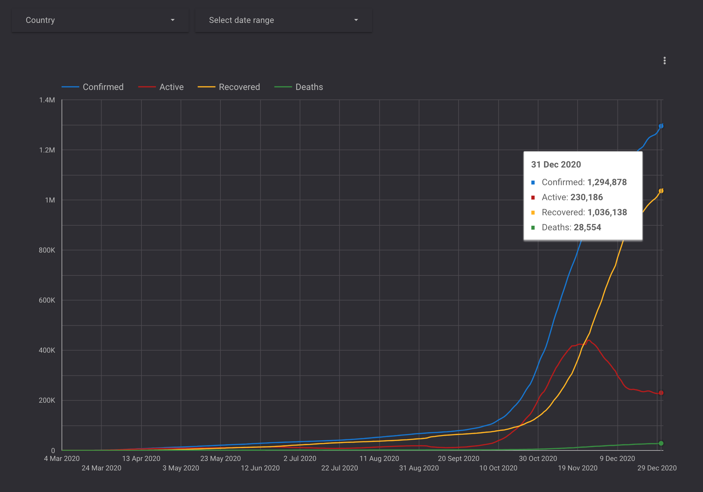

# Covid-19 data studio connector 

Covid-19 connector imports covid-data into data studio from covid19api.com. It provides information how many cases (Active,Confirmed, Recovered, Deaths) were registered from around 250 locations. 
    
Connector is based on a free plan of covid19api which has limitations. 
  
Some locations have no data (i.e.Niue). One country: USA has a response which can't be fetched properly based on a free plan.

Connector url: https://datastudio.google.com/datasources/create?connectorId=AKfycbxSAWQL9j2gpjOcXgOnHCF9cJim3wmRlE9t4ca2RqX_LsHGdQ7EVcUnJw8v8-hBaSQSKQ

Video link: https://youtu.be/m9FugnDef0k  